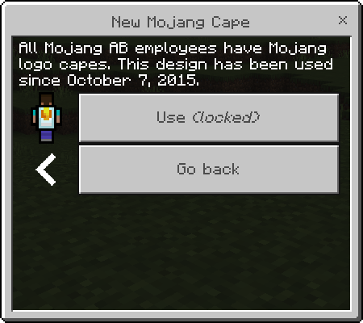
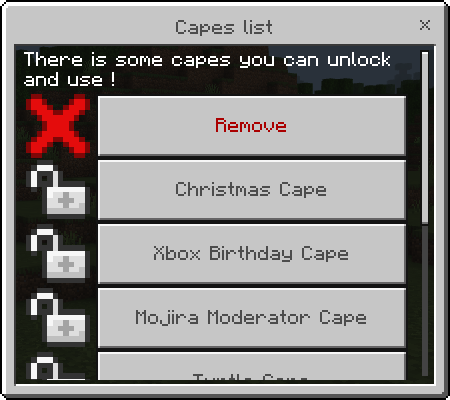
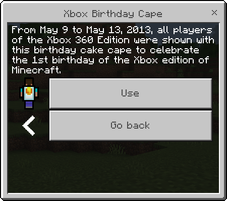
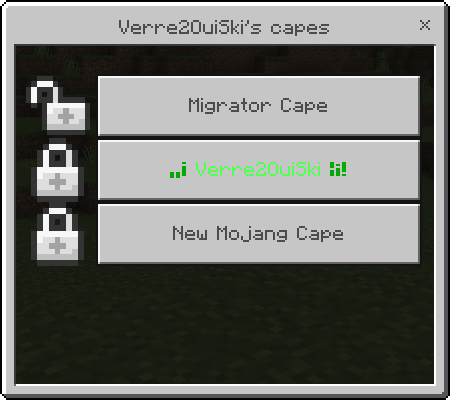

# 🥋 CapesLocker
<style>
    #card_container{
        display: flex;
        justify-content: space-around;
        align-items: stretch;
        flex-wrap: wrap;
    }
    .card{
        display: inline-block;
        width: 20%;
        padding: 1%;
        margin: 2%;
        background-color: red;
    }
    .card>img{
        width: 100%;
        height: auto;
    }
</style>
<p align="center">
    </img>
    <br>
    <b>
      A configurable <i>PocketMine-MP</i> plugin allows you to add capes to your server !
      <!-- </img> -->
    </b>
    <br>
    <div id="card_container">
        <!-- YOUR CAPES MENUS -->
        <div class="card">
            </img>
            <div align="center">
                <h4><b>A capes locker menu !</b></h4>
                <p>With this menu, see all capes you can have and chose one of them !</p>
            </div>
        </div>
        <div class="card">
            </img>
            <div align="center">
                <h4><b>When cape is unlocked</b></h4>
                <p>This is the menu when you select a cape you have unlocked.<br>You can equip it or go back to capes menu</p>
            </div>
        </div>
        <div class="card">
            </img>
            <div align="center">
                <h4><b>When cape is locked</b></h4>
                <p>This is the menu when you select a locked of your locker.<br>You can't equip it <i>(because you don't unlocked it)</i> but you can go back to capes menu</p>
            </div>
        </div>
        <!-- MANAGE CAPE MENUS -->
        <div class="card">
            </img>
            <div align="center">
                <h4><b>When cape is locked</b></h4>
                <p></p>
            </div>
        </div>
        <div class="card">
            </img>
            <div align="center">
                <h4><b>When cape is locked</b></h4>
                <p></p>
            </div>
        </div>
        <div class="card">
            </img>
            <div align="center">
                <h4><b>When cape is locked</b></h4>
                <p></p>
            </div>
        </div>
    </div>

</p>


# 💻 Commands

Command | Aliases | Permission | Default | Description
---- | --- | --- | --- | ---
`/capes` |  | capeslocker.command.capes | `true` | Open your capes locker menu !
`/mcapes <player> [cape id] [lock\|unlock]` | `mcapes` | capeslocker.command.managecapes | `op` | Manage capes of a player
`/playerscapescleaner` |  | capeslockers.command.playerscapescleaner | `op` | WARNING ! This command remove all undefined capes in 'capes.json' from capes lockers of players.


# 💾 Config

```yaml
---
#
#   __      __                ___   ____        _  _____ _    _
#   \ \    / /               |__ \ / __ \      (_)/ ____| |  (_)
#    \ \  / /__ _ __ _ __ ___   ) | |  | |_   _ _| (___ | | ___
#     \ \/ / _ \ '__| '__/ _ \ / /| |  | | | | | |\___ \| |/ / |
#      \  /  __/ |  | | |  __// /_| |__| | |_| | |____) |   <| |
#       \/ \___|_|  |_|  \___|____|\____/ \__,_|_|_____/|_|\_\_|
#

# Do you have a problem ?
# 
# Discord (en) : https://discord.gg/P8R4WhARrY
# Discord (fr) : https://discord.gg/DnmRbAxMbN


# Time in seconds
cape_cooldown: 10
# {cooldown}  Amout of time you must wait before set a new cape
cooldown_message: "§cYou must wait {cooldown} seconds between every cape changed"
# {cape}    The cape name
cape_equiped_message: "You equiped {cape}"
# {cape}    The cape name
locked_cape_message: "You must unlock {cape} before use it"

menu_title: "Capes list"
menu_body: "There is some capes you can unlock and use !"
...
```


# 📫 Reach me

<div align="center">
    <a href="https://discord.gg/P8R4WhARrY">
        </img>
    </a>
    <a href="https://twitter.com/Verre2OuiSki">
        </img>
    </a>
    <a href="https://discord.gg/DnmRbAxMbN">
        </img>
    </a>
</div>